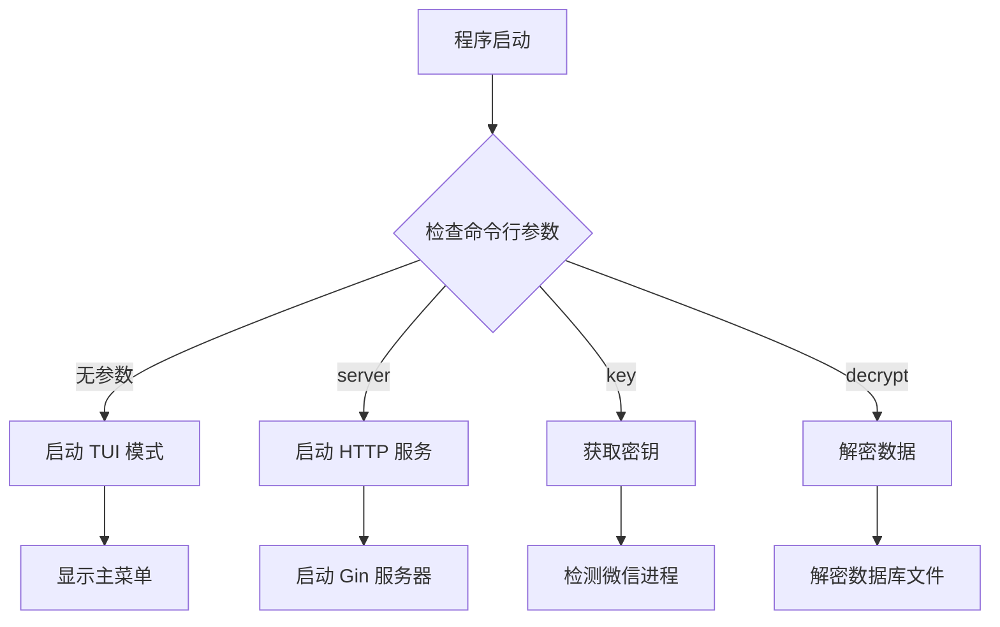
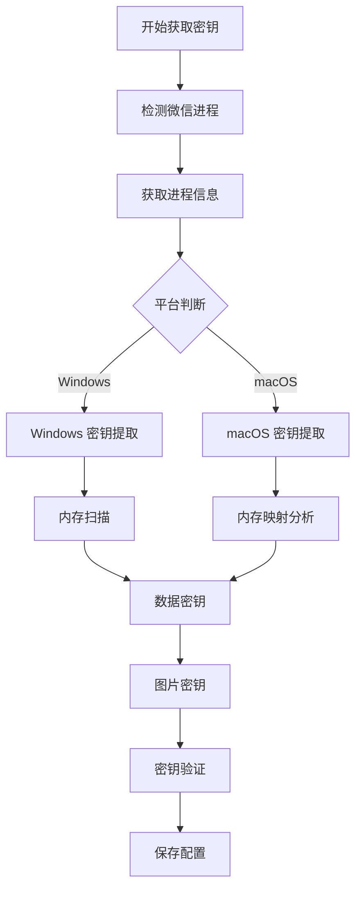
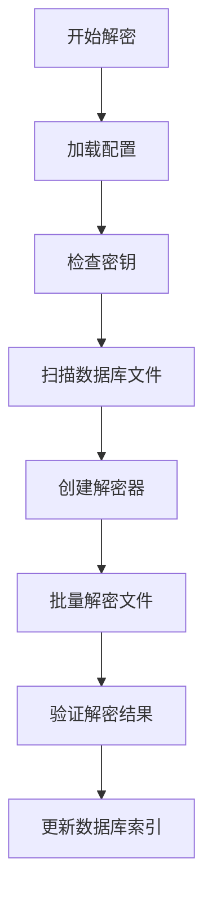
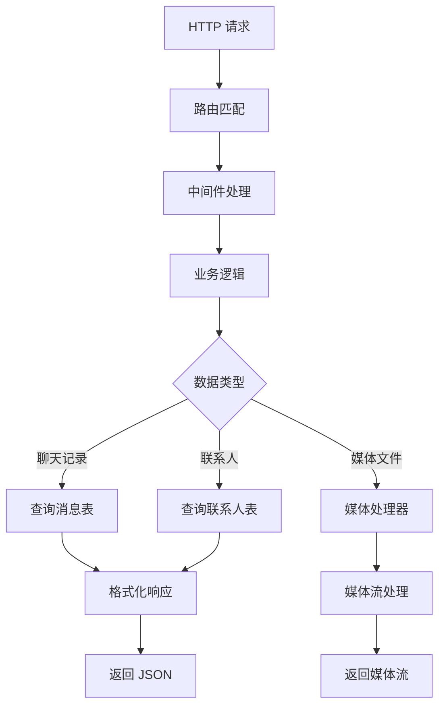

# Chatlog 系统架构

## 概览

Chatlog 是一个用于微信聊天记录管理和分析的 Go 语言应用程序，支持从本地微信数据库中提取、解密和提供聊天记录服务。

## 🏗️ 整体架构

```
┌─────────────────────────────────────────────────────────────┐
│                    Chatlog Application                       │
├─────────────────────────────────────────────────────────────┤
│  CLI Interface (Cobra)        │  Terminal UI (TView)        │
│  ├─ server                    │  ├─ 主菜单                   │
│  ├─ key                       │  ├─ 设置                     │
│  ├─ decrypt                   │  ├─ 账号切换                 │
│  └─ version                   │  └─ 帮助                     │
├─────────────────────────────────────────────────────────────┤
│                    HTTP Server (Gin)                         │
│  ├─ REST API                  │  ├─ MCP Server               │
│  ├─ Static Files              │  ├─ SSE Support              │
│  └─ Media Streaming           │  └─ Webhook Support          │
├─────────────────────────────────────────────────────────────┤
│                   Business Logic Layer                       │
│  ├─ WeChat Manager            │  ├─ Database Manager         │
│  ├─ Decrypt Manager           │  ├─ Media Processor          │
│  └─ Session Manager           │  └─ File Monitor             │
├─────────────────────────────────────────────────────────────┤
│                    Data Access Layer                         │
│  ├─ Repository Pattern        │  ├─ Multi-Version Support    │
│  ├─ SQLite Operations         │  ├─ Cross-Platform           │
│  └─ Data Models               │  └─ Database Abstraction     │
├─────────────────────────────────────────────────────────────┤
│                      Storage Layer                           │
│  ├─ WeChat Databases          │  ├─ Media Files              │
│  ├─ Decrypted Databases       │  ├─ Voice Processing         │
│  └─ Configuration Files       │  └─ Image Decryption         │
└─────────────────────────────────────────────────────────────┘
```

## 📁 项目结构

### 核心目录

```
chatlog/
├── cmd/chatlog/           # 命令行接口
│   ├── root.go           # 根命令和 TUI 入口
│   ├── cmd_server.go     # HTTP 服务器命令
│   ├── cmd_key.go        # 密钥获取命令
│   ├── cmd_decrypt.go    # 数据解密命令
│   └── cmd_version.go    # 版本信息命令
├── internal/
│   ├── chatlog/          # 应用核心逻辑
│   ├── errors/           # 错误处理
│   ├── mcp/              # MCP 协议实现
│   ├── model/            # 数据模型
│   ├── ui/               # Terminal UI 组件
│   ├── wechat/           # 微信相关功能
│   └── wechatdb/         # 数据库操作
├── pkg/                  # 公共工具包
└── docs/                 # 项目文档
```

## 🔧 核心组件

### 1. 命令行接口 (cmd/chatlog)

**职责**: 提供用户交互入口，支持命令行和 TUI 两种模式

- **root.go**: Cobra 命令框架集成，TUI 启动
- **cmd_server.go**: HTTP 服务启动命令
- **cmd_key.go**: 密钥提取命令
- **cmd_decrypt.go**: 数据解密命令

### 2. 应用核心 (internal/chatlog)

**职责**: 应用程序主要业务逻辑

- **app.go**: TUI 应用程序主类
- **manager.go**: 核心业务管理器
- **conf/**: 配置管理
- **ctx/**: 应用上下文
- **http/**: HTTP 服务器实现
- **webhook/**: Webhook 功能

### 3. 微信集成 (internal/wechat)

**职责**: 微信进程检测、密钥提取、数据解密

```
wechat/
├── wechat.go           # 微信管理器主入口
├── manager.go          # 微信实例管理
├── process/            # 进程检测
│   ├── detector.go     # 跨平台进程检测
│   ├── darwin/         # macOS 特定实现
│   └── windows/        # Windows 特定实现
├── key/                # 密钥提取
│   ├── extractor.go    # 密钥提取器
│   ├── darwin/         # macOS 密钥提取
│   └── windows/        # Windows 密钥提取
└── decrypt/            # 数据解密
    ├── decryptor.go    # 解密器接口
    ├── darwin/         # macOS 解密实现
    └── windows/        # Windows 解密实现
```

### 4. 数据库层 (internal/wechatdb)

**职责**: 微信数据库操作和数据访问

```
wechatdb/
├── wechatdb.go         # 数据库管理器主入口
├── repository/         # 仓库模式数据访问
│   ├── repository.go   # 仓库接口定义
│   ├── message.go      # 消息数据访问
│   ├── contact.go      # 联系人数据访问
│   ├── chatroom.go     # 群聊数据访问
│   ├── session.go      # 会话数据访问
│   └── media.go        # 媒体数据访问
└── datasource/         # 数据源抽象层
    ├── datasource.go   # 数据源接口
    ├── darwinv3/       # macOS v3.x 数据源
    ├── windowsv3/      # Windows v3.x 数据源
    ├── v4/             # v4.x 数据源
    └── dbm/            # 数据库连接管理
```

### 5. 数据模型 (internal/model)

**职责**: 定义数据结构和协议

- 支持多版本微信数据格式
- Protocol Buffers 消息定义
- 跨平台数据模型适配

### 6. MCP 协议 (internal/mcp)

**职责**: Model Context Protocol 实现

- **mcp.go**: MCP 服务器主实现
- **sse.go**: Server-Sent Events 支持
- **stdio.go**: 标准输入输出支持
- **tool.go**: MCP 工具定义
- **resource.go**: 资源管理

## 🔄 数据流程

### 1. 启动流程



### 2. 密钥获取流程



### 3. 数据解密流程



### 4. HTTP API 请求流程



## 🎯 设计模式

### 1. 仓库模式 (Repository Pattern)
- 抽象数据访问层
- 支持多数据源
- 便于测试和扩展

### 2. 工厂模式 (Factory Pattern)
- 根据平台和版本创建相应的处理器
- 解耦具体实现

### 3. 策略模式 (Strategy Pattern)
- 不同平台的密钥提取策略
- 不同版本的数据解密策略

### 4. 观察者模式 (Observer Pattern)
- 文件监控和自动解密
- 实时状态更新

## 🔧 技术选型

### 后端框架
- **Gin**: 高性能 HTTP 框架
- **Cobra**: 命令行应用框架
- **TView**: Terminal UI 框架

### 数据库
- **SQLite**: 轻量级数据库
- **go-sqlite3**: SQLite Go 驱动

### 协议支持
- **HTTP REST API**: 标准 Web API
- **Server-Sent Events**: 实时数据推送
- **MCP**: Model Context Protocol
- **WebSocket**: 实时通信 (计划中)

### 跨平台支持
- **Windows**: 完整功能支持
- **macOS**: 完整功能支持
- **Linux**: 基础功能支持 (计划中)

## 📈 性能优化

### 1. 数据库优化
- 连接池管理
- 查询优化
- 索引策略

### 2. 内存管理
- 大文件流式处理
- 缓存策略
- 垃圾回收优化

### 3. 并发处理
- Goroutine 池
- 锁优化
- 异步处理

## 🔒 安全考虑

### 1. 数据保护
- 本地数据处理
- 敏感信息加密存储
- 访问权限控制

### 2. 进程安全
- 内存访问保护
- 权限检查
- 安全审计

### 3. 网络安全
- 本地服务绑定
- CORS 配置
- 输入验证

## 🚀 扩展性

### 1. 新版本支持
- 版本检测机制
- 动态适配器
- 向后兼容

### 2. 新功能集成
- 插件系统 (计划中)
- API 版本管理
- 功能开关

### 3. 新平台支持
- 平台抽象层
- 条件编译
- 统一接口